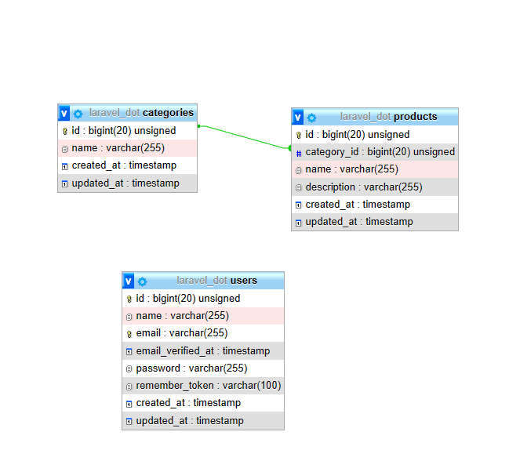

<h1 align="center">Selamat datang di website Kami! 👋</h1>

## Website apa ini?

Website ini merupkana website untuk mendata produk produk yang ada dengan bisa dibagi ebrdasrkan kategori yang tersedia.
 👋👋

## Fitur apa saja yang tersedia di Laundry?

-   Autentikasi User
-   Category & CRUD
-   Product & CRUD

---

## Desain Database

## Screenshot Aplikasi


## Install

1. **Clone Repository**

```bash
git clone https://github.com/Shankara21/Kitabantuin.git
cd Kitabantuin
composer install
npm install
cp .env.example .env
```

2. **Buka `.env` lalu ubah baris berikut sesuai dengan databasemu yang ingin dipakai**

```bash
DB_PORT=3306
DB_DATABASE=laravel_dot
DB_USERNAME=root
DB_PASSWORD=
```

3. **Instalasi website**

```bash
php artisan key:generate
php artisan migrate --seed
php artisan jwt:secret
php artisan config:cache
```

4. **Jalankan website**

```bash
php artisan serve
```

## License

-   Copyright © 2022 
